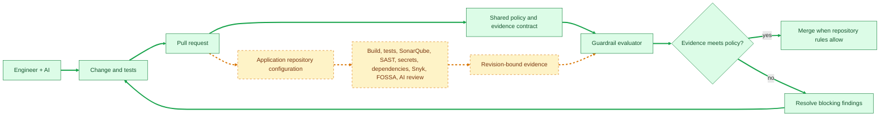
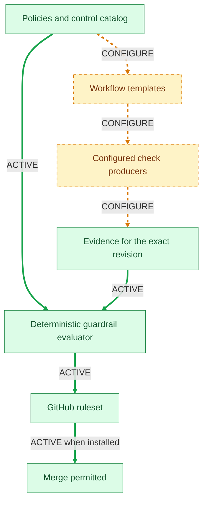
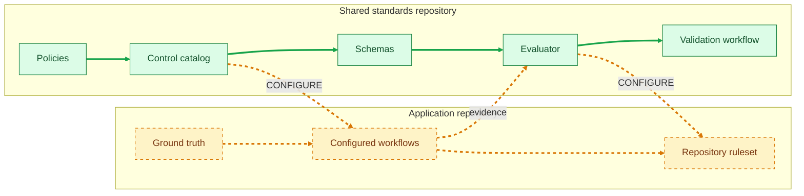

# Architecture

This repository has two jobs:

1. Define the engineering policy and evidence contract.
2. Give application repositories reusable building blocks for enforcing that
   policy.

It does not become the application repository's architecture document. The
application repository remains responsible for its own code, commands,
services, credentials, ownership, and ground truth.

## Status legend

The diagrams use the following meaning:

| Visual | Meaning |
| --- | --- |
| **GREEN ✅** | GitHub-native control that can satisfy policy through GitHub settings, rulesets, or Actions. |
| **ORANGE 🟠** | Control that needs a third-party service or organization-owned external adapter. |
| **GRAY ⚪** | Repository-specific configuration or a shared template; no external vendor is implied. |
| Green arrow | Active path with a real producer and validation. |
| Orange dashed arrow | Path that still needs external configuration. |
| Dashed border | A repository-owned adapter or external service is required. |

The check symbols describe how a control can be activated. They do not mean
that every consuming application has already enabled it. See
[control-status.md](control-status.md) for the exact boundary.

## Canonical repository layout

The five public areas are the product surface. Supporting implementation is
kept separate so application teams can consume the standards without needing
to understand the evaluator internals.

```text
policies/       Organization policy and control catalog
pr-review/      AI review contracts and finding conventions
workflows/      Reusable producer workflow templates
rulesets/       GitHub enforcement templates
skills/         Reusable agent capabilities

guardrails/     Policy/evidence schemas and deterministic evaluator
tooling/        Install, configure, scan, scorecard, and validation commands
docs/           Human and agent operating documentation
```

`policies/`, `pr-review/`, `workflows/`, `rulesets/`, and `skills/` are the
shared contract. `guardrails/` and `tooling/` make that contract executable.
`docs/` explains how to consume it. None of these folders own an application's
architecture, deployment model, or repository ground truth.

## The whole system



The solid green path is the shared repository's active control loop. The
amber dashed path is where each application repository supplies its own build
commands, test commands, scanner configuration, secrets, and AI adapter. Snyk
is an orange advisory provider on that path: teams can connect it and learn
from findings before promoting it to a required merge check.

## How policy becomes a merge decision



The evaluator can only make a trustworthy decision when a check has a real
producer and the evidence identifies the revision under review. A template
without a configured producer is not a passing check.

## Where the controls run



The shared repository owns reusable policy and enforcement components. The
application repository owns the facts and configuration that only it can
know.

## Control lifecycle

Every control follows the same path:

```text
Policy
  → producer
  → evidence for a revision
  → evaluator result
  → GitHub status check or ruleset requirement
```

If any step is missing, the control is documented as configurable rather than
shown as active. This prevents a workflow file or policy document from being
mistaken for enforcement.

## Related documents

- [Control status](control-status.md) — what is active, configurable, or future.
- [Control catalog](../policies/control-catalog.yaml) — machine-readable control contracts.
- [Workflow templates](../workflows/README.md) — how application repositories connect producers.
- [Ruleset notes](../rulesets/README.md) — how checks become merge protections.
- [Guardrail implementation](guardrails-implementation.md) — evidence and evaluator details.
